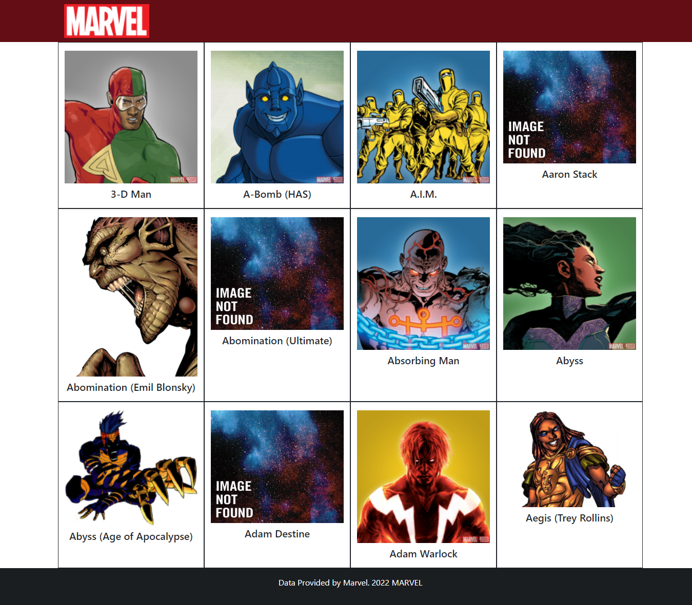
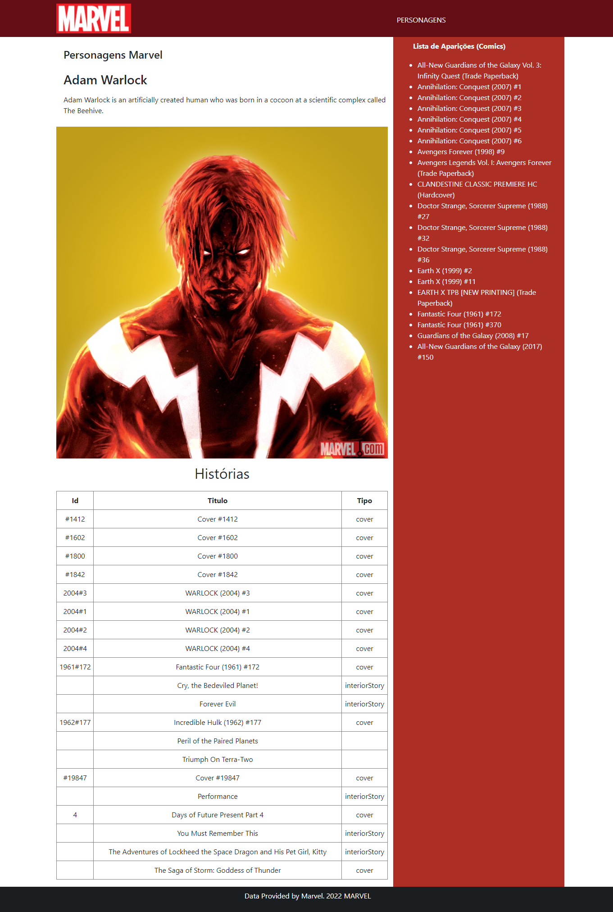
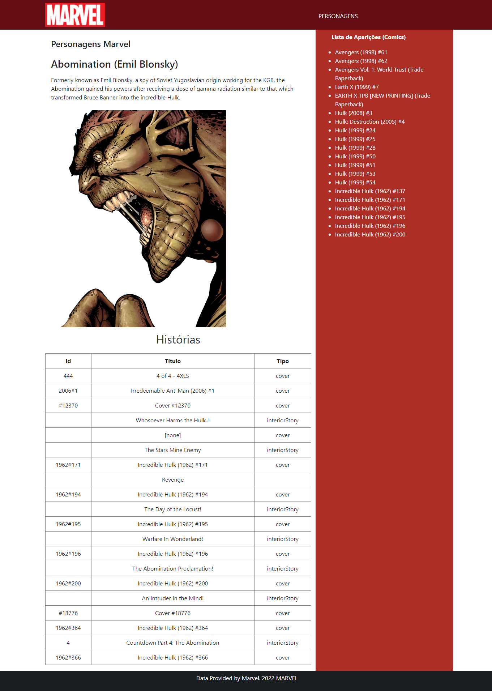

<h1 align="center"> Projeto Consumo API Marvel (Get ID / Filtro)  </h1>
<h3 align="center"> Projeto de Evidência  </h3>

 Tela construida em HTML utilizando Bootstrap 

 Api sendo consumida através do método XHR (XmlHTTPrequest) 

<h6>Get Filtro Exemplo:</h6>

<h6>Get Id / Primeiro Exemplo: </h6>

<h6>Get Id / Segundo Exemplo: </h6>
